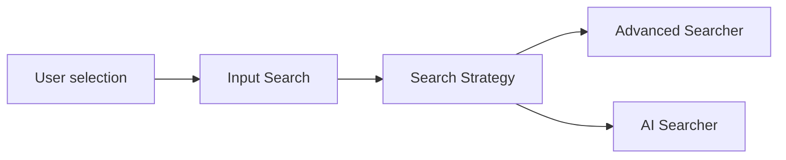

Este post va a ser un poco más técnico porque me gustaría hablar de un problema real que nos encontramos en un proyecto en el que trabajé.

La aplicación trataba de dar a usuarios técnicos y comerciales datos para tomar decisiones estratégicas y de negocio.

Al manejar muchos datos un buscador era casi imprescindible, teníamos un buscador bastante avanzado que no solo buscaba por el término introducido, sino también por términos relacionados y otros campos asociados.

Había un equipo que estaba preparando un LLM para la compañía y desde negocio vieron una buena oportunidad para integrarlo en nuestra aplicación, más concretamente desde el buscador.

<!-- truncate -->

## Qué dudas se nos vinieron a la mente

Para que tengáis una visión clara, el buscador avanzado era simplemente un input con un icono de lupa, al añadir este nuevo comportamiento desde diseño se opto por añadir un switch para que el usuario pudiera elegir que tipo de búsqueda quería, "avanzado" o con "IA".

Algo más o menos así:


Empezamos a pensar como podríamos integrarlo en nuestro buscador, pero empezamos a ver problemas porque tanto la búsqueda y como se mostraban los resultados eran totalmente diferentes.

A simple vista empezamos a notar que añadir la lógica entre medias de la implementación actual no iba a ser una buena idea.

La alternativa habría sido añadir condicionales dentro del buscador existente, mezclando comportamientos distintos en una misma pieza y aumentando el acoplamiento.

Si queríamos agregar todo este nuevo comportamiento a nuestro buscador debería cumplir con los siguientes requerimientos.

1. No afectar al comportamiento actual del buscador avanzado.
2. Que no estuviera acoplado al buscador avanzado y tuviera independencia de él.
3. Que las dos soluciones fueran mantenibles fácilmente.

Entonces vimos que la solución pasaba por separar comportamientos. Con el tiempo entendí que esta aproximación encaja bastante bien con lo que se conoce como el patrón `strategy`.

:::note[*es una versión del patrón Strategy adaptada a React.*]

No aplicamos Strategy de forma académica, con clases e interfaces como en muchos ejemplos clásicos. Lo llevamos a una versión más natural en React: una base común y varias implementaciones intercambiables para cada tipo de búsqueda.
:::

## Implementación de la solución

La idea central es tener varios comportamientos intercambiables detrás de una misma interfaz, y que el contexto (la selección del usuario) elija cuál usar sin meter condicionales por todo el flujo.

Vamos a hacer un pequeño esquema para entender mejor como planteamos la implementación:



En nuestro caso, la idea era mantener una base común para el buscador, maquetación, eventos y delegar las diferencias de comportamiento en estrategias separadas: búsqueda avanzada, búsqueda con IA, etc.

Tenemos los diferentes tipos de búsqueda con un `enum` y un `type`.

```ts
const SearchModes = {
  ADVANCED: "ADVANCED",
  AI: "AI",
} as const;

type SearchMode = (typeof SearchModes)[keyof typeof SearchModes];
```

Además un `type` para los componentes con diferentes estrategias.

```ts
type SearcherProps = {
  term: string;
};

type SearchStrategy = {
  Searcher: ComponentType<SearcherProps>;
};
```

Las diferentes estrategias:

```ts
const strategies: Record<SearchMode, SearchStrategy> = {
  [SearchModes.ADVANCED]: {
    Searcher: AdvancedSearch,
  },
  [SearchModes.AI]: {
    Searcher: AISearch,
  },
};
```

Con esto ya tendríamos la base para ir montando componentes.

Los componentes que vamos a utilizar son los siguientes:

1. `InputSearch`: Es el componente principal el cual está formado por un `input` y un `switch` en este caso para elegir la estrategia.
2. `AdvancedSearch`: que tiene la funcionalidad del buscador avanzado (llamada a una API, transformación de la data, manejar como se muestran los datos, etc.)
3. `AISearch`: que tiene la funcionalidad del buscador con IA (llamada a una API, transformación de la data, manejar como se muestran los datos, etc.)

en `InputSearch` el usuario decide el tipo de búsqueda, y en base a esa decisión el componente selecciona la estrategia adecuada.

De esta forma evitamos duplicar UI y mantenemos la responsabilidad clara: el componente principal orquesta las estrategias que definen el comportamiento.

```ts
export const InputSearch = () => {
  // Añadimos el modo, por defecto será el modo de búsqueda avanzada.
  const [mode, setMode] = useState<SearchMode>(SearchModes.ADVANCED);
  // El término es un string vacío hasta que el usuario añada algún valor.
  const [term, setTerm] = useState("");
  // Se obtiene el modo de búsqueda que ha elegido el usuario.
  const strategy = strategies[mode];
  // El componente Searcher con el comportamiento que queremos.
  const Searcher = strategy.Searcher;

  return (
    <section>
      <div>
        <Input
          placeholder="Buscar"
          value={term}
          onChange={(event) => setTerm(event.target.value)}
          // En un caso real, el switch estaría separado. Aquí lo simplifico para centrarme en la idea.
          onSwitch={(value) => setMode(value)}
        />
      </div>
      {/* Resultados de búsqueda */}
      <div>
       <Searcher term={term} />
      </div>
    </section>
  );
};
```

Componentes de búsqueda con IA y avanzado, los he simplificado al máximo para no añadir información innecesaria.

Pero la idea es que cada componente realice una llamada a un servicio, transforme datos, los muestre de una determinada manera y así su comportamiento queda encapsulado.

Llevado al caso real podrían mostrar diferentes tipos de resultados, podría ser que el buscador avanzado devolviera una lista de elementos y el buscador con IA devolviera otro tipo de estructura.

```ts
const AdvancedSearch = ({ term }: SearcherProps) => {
// Aquí podríamos llamar a un servicio, transformar datos, montar estructura de la respuesta en base a como muestra los resultados el buscador avanzado.
  return (
    <article className={styles.result}>
      <h3>Búsqueda avanzada</h3>
      <p>
        Resultados filtrados mediante el buscador avanzado para el término: <strong>{term}</strong>
      </p>
    </article>
  );
};
```

```ts
const AISearch = ({ term }: SearcherProps) => {
// Aquí podríamos llamar a un servicio, transformar datos, montar estructura de la respuesta en base a como muestra los resultados el buscador con IA.
  return (
    <article className={styles.result}>
      <h3>Búsqueda con IA</h3>
      <p>
         Resultados filtrados mediante el buscador con IA para el término: <strong>{term}</strong>
      </p>
    </article>
  );
};
```

## Conclusión

Cuando una nueva funcionalidad cambia mucho el comportamiento de una pieza existente, conviene parar antes de meter lógica “entre medias”. A veces la solución no es añadir más condicionales, sino separar responsabilidades.

En nuestro caso, añadir IA al buscador era un cambio de comportamiento. Mezclar ambas cosas en la misma implementación habría complicado el mantenimiento y aumentado el acoplamiento.

Separar los comportamientos nos permitió mantener una base común y establecer cada tipo de búsqueda de forma independiente.

Al final no se trata de aplicar patrones por aplicarlos, sino de llegar a soluciones que nos permitan:

- Mantener el código entendible cuando la aplicación crece.
- Evitar mezclar responsabilidades distintas entre componentes o partes de nuestra aplicación.
- Modificar o extender funcionalidades sin romper nada.
