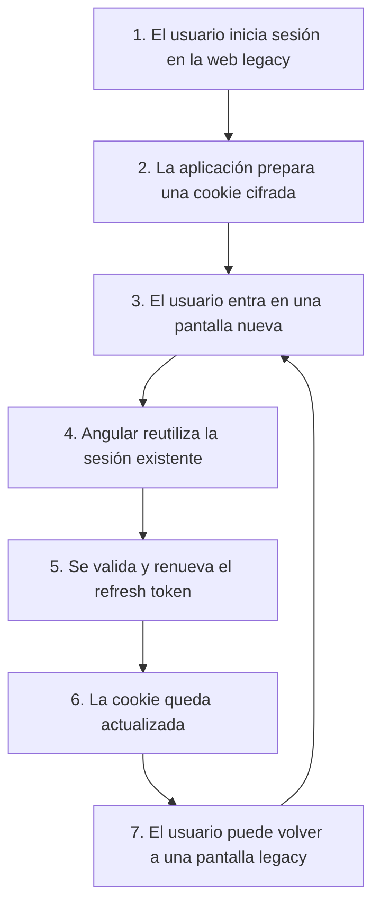

Este fue uno de los primeros proyectos donde entendí que migrar una aplicación no va solo de cambiar tecnología.

Partíamos de un sistema legacy con `aspx`, `jQuery` y `JavaScript nativo`.

Funcionaba, tenía usuarios y llevaba tiempo en producción.

La idea era migrar a `Angular` para mejorar mantenibilidad, poder evolucionar más rápido y tener una aplicación más moderna y escalable, además de tener las ventajas de una `spa`.

Pero el problema era el siguiente: No podíamos apagar lo antiguo y encender lo nuevo. Teníamos que convivir con ambos durante bastante tiempo.

<!-- truncate -->

## El problema de verdad

El problema con la migración de nuestra aplicación legacy a la nueva aplicación con Angular era que el usuario no debía de notar nada, no se podía perder la sesión y aunque la interfaz cambiara ligeramente no se rompiera el flujo ni la experiencia de usuario en este proceso.

Si queríamos migrar poco a poco, había que conseguir que ambas partes “compartieran” sesión de alguna forma.

Este proceso no fue solo frontend, pero cuento la parte en la que sí pude participar.

Establecimos una solución en torno a una cookie que servía como punto común para poder persistir sesión aunque fueran aplicaciones distintas.

El flujo era el siguiente:

1. El usuario hacía login en la parte legacy:
2. Se llamaba al servicio de autenticación y se obtenían los tokens.
3. Desde backend se generaba una cookie con datos de sesión cifrados, incluyendo el `refreshtoken`.
4. Desde el front esa cookie se guardaba en el navegador.

No recuerdo todos los detalles, pero la cookie la generaba backend y tenía flags de seguridad como httpOnly, secure y sameSite, además de estar encriptada, así que los tokens no estaban expuestos tal cual en el front.

Cuando el usuario entraba en una pantalla nueva en Angular:

1. Se leía esa cookie.
2. Se enviaba el `refreshtoken` al backend.
3. Si todo era correcto, el backend devolvía una nueva versión de la cookie actualizada.
4. Se sobreescribía en el navegador.

Y esto pasaba en ambos sentidos. Si volvías de Angular a la parte legacy, el proceso era el mismo.

Visto desde fuera (por el lado del usuario), parecía una navegación normal.

Por debajo, lo que estaba pasando era que la sesión se “rehidrataba” cada vez que cambiabas de una aplicación a otra.

## Cómo fuimos migrando

Una vez teníamos esto resuelto, el resto era bastante más simple.

Cada nueva pantalla se hacía en `Angular`.
Se añadía a producción.
Se eliminaba la versión antigua en `aspx`.

Para que las rutas funcionaran, se utilizó un balanceador que decidía a qué aplicación iba cada URL.

El usuario no sabía si estaba en una o en otra.

## Lo que me llevé de esto

Durante mucho tiempo pensé que migrar era elegir bien el framework y no tenía muchas más implicaciones.
Con esta experiencia vi que negocio necesita entregar valor lo antes posible.
Además por el lado técnico necesitamos hacer cambios y entregar funcionalidades sin cargarte lo que ya funciona.

No migramos una MPA a una SPA en un solo paso (lo que hubiera llevado meses si no años)

Fuimos sustituyendo piezas sin que el usuario perdiera la sesión y sin que se diera cuenta.

Y fuimos entregando valor desde el día 1.
