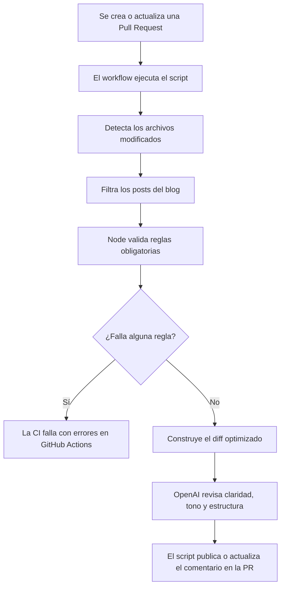
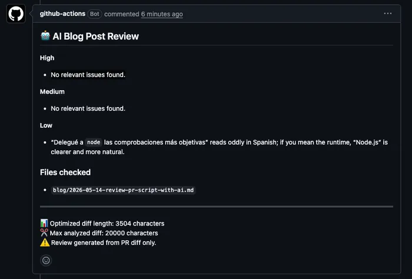
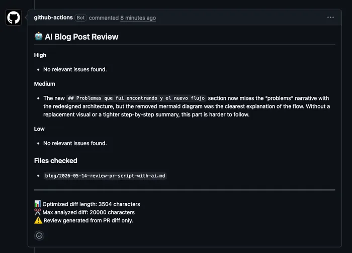
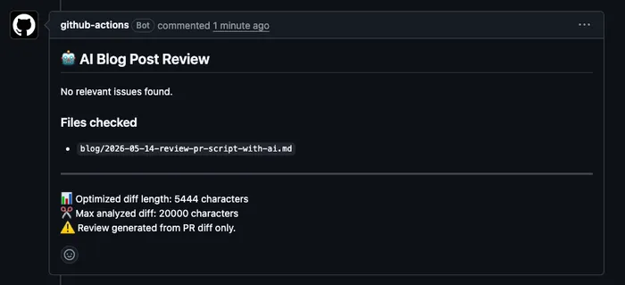

Mientras escribía los primeros posts del blog me di cuenta de que repetía algunos errores antes de publicar.

No eran errores enormes, pero sí lo bastante molestos como para hacerme perder tiempo revisando PRs, imágenes, estructura y detalles de estilo.

Esto me ralentizaba mucho a la hora de crear, revisar y modificar.

Antes de entrar en la solución, pongo un poco de contexto técnico sobre el blog.

<!-- truncate -->

Para dar más contexto cada post está escrito en archivos `md` que mediante el framework son convertidos a `html`, así que cualquier cambio pasa por el flujo normal de trabajo: commit, push y Pull Request.

El problema aquí es que muchas veces subía un post con algunos errores:

- Añadía el thumbnail pero no la imagen de cabecera.
- Algunas secciones eran demasiado largas.
- Algunas explicaciones técnicas no eran lo suficientemente profundas.
- En algún caso obviaba información que yo sí tenía pero el lector no.
- Alguna falta de ortografía o de puntuación.

Entonces pensé en una solución que pudiera ayudarme a revisar antes de mergear la PR: añadir IA a mi flujo de CI.

## El flujo de CI con IA que había implementado al principio

La implementación es bastante sencilla, pero ahí no está el valor.

El valor está en comprobar si esta automatización ayuda de verdad o si solo añade ruido al flujo de desarrollo.

Estoy utilizando `GitHub Actions` y la `API` de OpenAI.

El flujo en resumidas cuentas consiste en lo siguiente:

1. Detecta qué archivos han cambiado en la Pull Request.
2. Genera un diff reducido para no enviar información innecesaria a la IA.
3. Decide si merece la pena ejecutar la review o si puede saltarla.
4. OpenAI analiza posibles problemas y genera o actualiza un comentario en la PR.

## Problemas que fui encontrando

Aunque era útil para mi caso, también empezó a generar bastante ruido:

- Sugerencias discutibles.
- Comentarios redundantes.
- Cambios de estilo que no quería.
- Críticas técnicamente correctas pero irrelevantes.

A veces veía problemas donde no los había y otras veces no detectaba partes que sí eran importantes.

Uno de los problemas más curiosos fue el tono.

La IA empezaba a sugerir cambios técnicamente correctos pero que hacían que el texto sonara menos mío.

Eso me obligó a ajustar bastante el prompt.

Quería una revisión que mantuviera mi estilo y eso a día de hoy sigue siendo muy complicado.

## Qué le pedí exactamente a la IA

Una de las partes más importantes fue dejar claro qué quería revisar.

Aquí es donde me di cuenta de que tenía que separar dos comprobaciones y que hasta ahora lo estaba haciendo mal.

Antes estaba delegando toda la revisión a la IA.

Ahí me di cuenta de que estaba mezclando dos problemas distintos: validaciones objetivas y revisiones subjetivas.

Por un lado, las cosas objetivas:

- Si el post tenía imagen de portada.
- Si el post tenía tags.
- Si el post tenía descripción.

Por otro lado, las cosas más subjetivas y que merecían debate en la PR:

- Si el título y la descripción tenían sentido.
- Si alguna sección era demasiado larga.
- Si estaba dando por hecho contexto que el lector no tenía.
- Si el tono sonaba demasiado artificial.
- Si la implementación técnica tenía sentido (en el caso de algún post más técnico).

Esto cambió bastante el resultado.

Delegué a `node` las comprobaciones más objetivas y el resto a la IA.

La IA trabaja mejor cuando le damos contexto, límites claros y ejemplos concretos de lo que esperamos.

Cuando el prompt era demasiado abierto, la IA opinaba demasiado.
Cuando definí mejor tanto el flujo como el prompt, empezó a ser más útil.

## Cómo quedó el nuevo flujo

## Ejemplos reales

Para dar algunos ejemplos de cómo está funcionando actualmente el flujo tenemos tres tipos de casos.

A veces hace recomendaciones que no aportan demasiado, pero tampoco me molestan especialmente.

Otras veces sí que aporta valor.

Por ejemplo, inicialmente había eliminado el diagrama del flujo porque me parecía innecesario. Después de esta sugerencia decidí volver a incluirlo porque probablemente ayuda a entender mejor cómo funciona la automatización.

Y otras veces simplemente no encuentra nada.

## Conclusiones

Tengo algunas conclusiones claras:

- Meter IA en un workflow no significa automáticamente mejorar el workflow.
- No todo necesita IA: Quizás algunas comprobaciones deban ser reglas simples y no una llamada a la IA.
- Hay que vigilar si la automatización está generando valor o solo ruido.

Por ejemplo, validar que un post tiene imagen de portada o que el frontmatter está completo probablemente no necesita OpenAI.

Eso puede resolverse con un script.

En cambio, revisar si una explicación se entiende, si el tono suena artificial o si estoy dando por hecho contexto que el lector no tiene, encaja mejor con una revisión asistida por IA.

Lo difícil es tener criterio suficiente para decidir:

- Qué automatizar.
- Qué ignorar.
- Y qué decisiones deberían seguir siendo humanas.

Automatizar una review es relativamente fácil. Saber qué merece una regla fija, qué merece una opinión y qué decisiones deben seguir siendo humanas es bastante más complicado.
