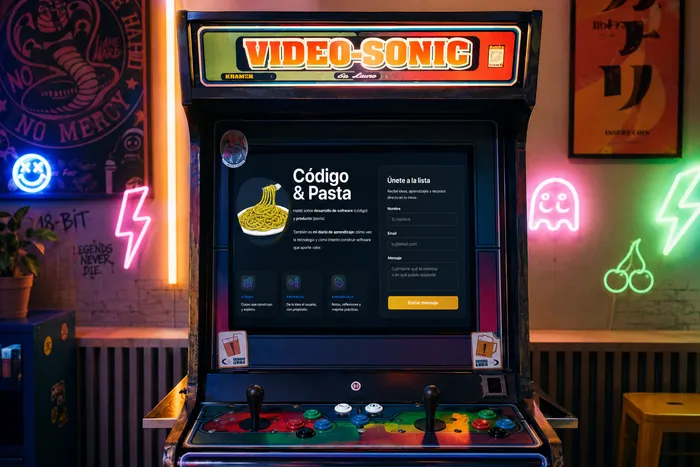

En uno de los proyectos en los que participé tuvimos que resolver un problema bastante común: los usuarios no completaban suficiente información en su perfil.

La aplicación era una plataforma de recursos humanos. Los candidatos rellenaban sus datos, experiencia, estudios y otra información relevante para poder inscribirse a ofertas de empleo.

El negocio era claro: conectar empresas que necesitaban talento con candidatos que buscaban trabajo.

El problema era que, si el usuario no completaba bien su perfil, las empresas no podían valorar correctamente a los candidatos.

Y si las empresas no podían valorar bien a los candidatos, los candidatos tenían menos opciones de avanzar en los procesos.

El problema afectaba tanto a las empresas como a los candidatos.

<!-- truncate -->

## ¿Por qué hacía falta cambiar?

El problema no era solo visual ni técnico.

La aplicación pedía demasiada información al usuario y lo hacía en un momento delicado: cuando una persona está buscando trabajo, probablemente con poco tiempo, poca paciencia y, en algunos casos, poca soltura con herramientas digitales.

Rellenar un formulario enorme no era precisamente motivador.

Y para negocio, esa falta de información tenía un impacto directo: perfiles menos completos, candidaturas más pobres y menos valor para las empresas que buscaban talento.

El proyecto necesitaba un cambio a varios niveles:

- **Técnico**: Migramos una `MPA` a una `SPA` con Angular. Eso nos ayudó a ordenar mejor la arquitectura frontend, reutilizar componentes y construir una experiencia más fluida.
- **Experiencia de usuario**: Los usuarios no rellenaban demasiados datos y cuando se inscribían a las ofertas de las empresas eran insuficientes para valorar candidatos.

## Por qué la gamificación encajaba en este caso

La gamificación funcionó bastante bien.

El problema real era que el usuario tenía que rellenar mucha información y no percibía claramente qué ganaba a cambio.

Con el nuevo modelo, cada bloque completado tenía una consecuencia visible: el usuario subía de nivel, veía progreso y desbloqueaba herramientas.

Por ejemplo, cuando el usuario añadía sus datos básicos, alcanzaba el nivel 1 y aparecía una animación de progreso, algo parecido a un cohete despegando.

Ya no eran los formularios complejos y interminables.

Lo importante era que el usuario entendía que estaba avanzando.

A medida que el usuario subía de nivel, también desbloqueaba herramientas útiles.

Una de ellas era un constructor de CV.

A partir de los datos que ya había completado, podía generar un CV en PDF usando diferentes plantillas. Ese CV podía descargarlo o compartirlo directamente desde la plataforma al inscribirse en una oferta.

Había una recompensa real.

Además utilizábamos diferentes componentes como:

- Un flujo guiado con pequeños formularios en cada paso.
- Modales con animaciones de progreso.
- Secciones diferenciadas con niveles, algunas desactivadas (las no desbloqueadas) y otras listas para utilizar.

Fue uno de esos proyectos en los que disfrutas porque ves claramente cómo una decisión de producto cambia la forma en la que los usuarios interactúan con la aplicación.

## Problemas de la gamificación

No todo funcionó bien desde el principio.

Algunos usuarios no entendían el modelo de niveles. Otros no estaban acostumbrados a este tipo de experiencias o simplemente no querían “jugar” dentro de una aplicación de empleo.

Y esto es importante: lo que para un equipo de producto puede parecer claro, visual y motivador, para ciertos usuarios puede parecer confuso o innecesario.

También aparecieron problemas técnicos con algunos dispositivos y comportamientos que tuvimos que ajustar.

Tuvimos que iterar desde frontend y UX para que el modelo fuera más comprensible.

## Dónde sí y dónde no

La gamificación puede ser un recurso muy potente, pero no funciona en cualquier contexto.

Funciona cuando ayuda al usuario a entender su progreso, reduce la sensación de esfuerzo y ofrece una recompensa clara.

En este proyecto tenía sentido porque estábamos transformando una tarea pesada, completar un perfil, en un proceso más guiado, visual y progresivo.

Pero si estoy en la aplicación de mi banco y voy a pedir una hipoteca o estoy construyendo mi cartera de inversión no quiero eso.

Necesito que me transmita seguridad, transparencia y fiabilidad.

En cambio, cuando la gamificación sí tiene sentido, debería aportar fluidez, sensación de progreso y un punto de diversión, sobre todo si la tarea original es aburrida.

Hay que tener criterio para decidir cuándo la gamificación puede ayudar y cuándo puede jugar en nuestra contra.

## Lo que aprendí

A nivel técnico fue un proyecto muy interesante porque nos obligó a cuidar varias cosas:

- **Animaciones**: tenían que aportar sensación de progreso.
- **Performance**: cuantos más recursos visuales añades, más fácil es estropear la experiencia si no los controlas.
- **Formularios**: dividir un formulario grande en pasos pequeños ayudaba a reducir la sensación de esfuerzo.
- **Arquitectura CSS**: al tener una interfaz tan visual, necesitábamos una arquitectura de estilos más ordenada.
- **Sistema de diseño**: los niveles, estados bloqueados, pasos, modales y recompensas necesitaban consistencia.
- **Arquitectura frontend**: la migración a Angular nos permitió ordenar mejor la experiencia y construir componentes reutilizables.

Pero el aprendizaje más importante para mí no fue técnico.

Fue entender que, como frontend, no solo implementamos pantallas.

También participamos en decisiones que afectan al comportamiento del usuario, al negocio y a la experiencia real del producto.

Porque el usuario no va a rellenar veinte campos sin nada a cambio.

Al menos no durante mucho tiempo.
