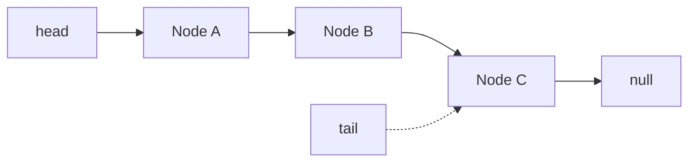

import { LinkedListDemo } from "./linkedListDemo";

# Linked List (Lista Enlazada)

¿Qué es una lista enlazada?

Una lista enlazada es una estructura de datos lineal donde cada elemento (nodo) contiene un valor y una referencia (puntero) al siguiente nodo en la secuencia.

A diferencia de los arrays, los nodos no están en posiciones contiguas de memoria, lo que da flexibilidad para insertar y eliminar sin mover al resto.

Piensa en una cadena de fichas: cada ficha guarda un valor y sabe quién viene después gracias a un puntero `next`. No hace falta que todas las fichas estén juntas en memoria como en un array, así que mover o insertar una ficha no obliga a recolocar las demás. Eso la hace muy cómoda para insertar y borrar.

## Node

Un nodo es la pieza básica: valor + puntero al siguiente.

```js
class Node {
  constructor(value) {
    this.value = value;
    this.next = null;
  }
}
```

## LinkedList (con `head` y `tail`)

La lista solo necesita saber dónde empieza y dónde termina. Con eso puede encadenar todos los nodos.

```js
class LinkedList {
  constructor() {
    this.head = null;
    this.tail = null;
  }
}
```

### Cómo funciona una Linked List

- `head`: referencia a la primera ficha; `null` si no hay nada.
- `tail`: referencia a la última ficha; `null` si no hay nada. Este puntero nos permite inserciones al final en O(1) sin recorrer toda la lista.
- Cada nodo apunta al siguiente; el último apunta a `null` para marcar el fin.

Diagrama mínimo con tres nodos y puntero a cola:



## Métodos clave

### add(value)

Para insertar al final sin recorrer toda la lista usamos `tail`.

Primero conectas el último nodo que existía con el nuevo, y luego mueves `tail` para que apunte a ese nuevo último. Así mantienes la cadena intacta y dejas lista la cola para la próxima inserción.

```js
add(value) {
  const node = new Node(value);
  if (!this.head) {
    this.head = node;
    this.tail = node;
  } else {
    this.tail.next = node; // enlaza viejo último -> nuevo
    this.tail = node;      // mueve tail al nuevo último
  }
}
```

### delete(value)

Elimina la primera coincidencia del valor.

Si el que borras es el primero, `head` avanza al siguiente.

Si borras en el medio, saltas ese nodo uniendo su anterior con su siguiente.

Y si justo quitaste el último, `tail` debe retroceder al nuevo último para que la cola siga apuntando bien.

```js
delete(value) {
  if (this.head?.value === value) {
    this.head = this.head.next;
    if (!this.head) this.tail = null; // si se vacía, cola a null
    return;
  }

  let current = this.head;
  while (current?.next) {
    if (current.next.value === value) {
      current.next = current.next.next; // saltar nodo
      if (!current.next) this.tail = current; // si quitaste el último
      break;
    }
    current = current.next;
  }
}
```

### size()

Cuenta nodos empezando desde `head`, sumando uno por cada paso hasta llegar a `null`.

```js
size() {
  let count = 0;
  let current = this.head;
  while (current) {
    count++;
    current = current.next;
  }
  return count;
}
```

### clear()

Vacía la lista de golpe: `head` y `tail` vuelven a `null`, como si acabaras de crear la estructura.

```js
clear() {
  this.head = null;
  this.tail = null;
}
```

## Ejemplo práctico

En la demo interactiva puedes:

- Agregar nodos al final: fíjate cómo el nuevo nodo se pega al último y `tail` se mueve.
- Ver la estructura con flechas `→` y `null` al final: así sabes dónde termina la cadena.
- Eliminar cualquier nodo: si quitas el primero, `head` avanza; si quitas el último, `tail` retrocede al nuevo final.
- Limpiar la lista completa: todo vuelve a `null`.

Prueba a añadir (A, B, C, D...), borra alguno del medio y luego el último. Observa cómo cambian las flechas y los punteros `head`/`tail`. Es la mejor forma de asimilarlo.

### Demo

<LinkedListDemo />
